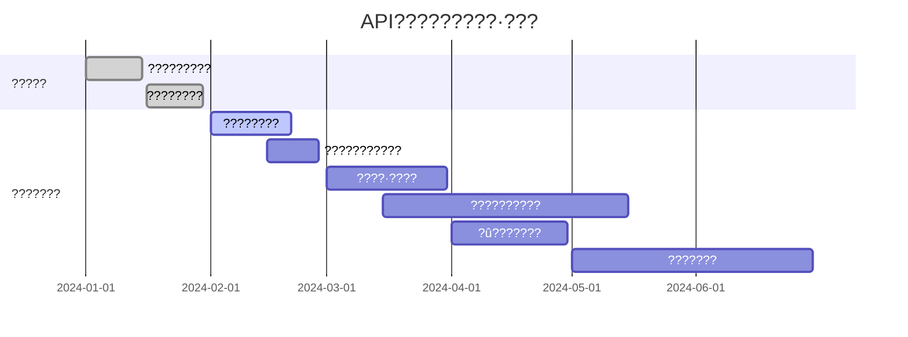

# 5. API???????????

## 5.1 ??????????

### 5.1.1 ??????
??????????3D???????API????ô???????????????????????????????????????????????????????

- **???????**??????API???÷???????ROI
- **????????**????????????????????????
- **????????**??????????????????????
- **?û????????**???????????????????

### 5.1.2 ??????????
```
        ?????    ?????    ?????
????   A??      B??      C??
????   A??      B??      C??  
????   A??      A??      B??

A????????  B????????  C???????
```

## 5.2 ?????????????????

### 5.2.1 ???????
?????????????????????????????

```java
@Service
public class IntelligentCacheService {
    
    // L1????????????????
    @Cacheable(value = "modelCache", key = "#inputHash")
    public ModelResult getFromMemoryCache(String inputHash) {
        return memoryCache.get(inputHash);
    }
    
    // L2????Redis????????????
    public ModelResult getFromRedisCache(String inputHash) {
        String cacheKey = "model:" + inputHash;
        return redisTemplate.opsForValue().get(cacheKey);
    }
    
    // L3?????????????û?????
    public ModelResult getFromDatabaseCache(String inputHash) {
        return cacheRepository.findByInputHash(inputHash);
    }
}
```

### 5.2.2 ??????????
**??????????????**
- **L1??????????**??15-20%????????<100ms??
- **L2??????????**??25-30%????????<500ms??
- **L3??????????**??35-40%????????<2s??
- **????????????**??70-90%
- **API???ü???**??70-90%

## 5.3 ??????????????????

### 5.3.1 ???????????
```java
@Service
public class SemanticSimilarityService {
    
    public SimilarityResult findSimilarModel(String inputText) {
        // 1. ?????????
        float[] inputVector = textEmbeddingService.getEmbedding(inputText);
        
        // 2. ????????????
        List<CachedModel> candidates = getCandidateModels(inputVector);
        
        // 3. ??????????????
        return candidates.stream()
            .map(model -> calculateSimilarity(inputVector, model))
            .filter(result -> result.getSimilarityScore() >= 0.85)
            .max(Comparator.comparing(SimilarityResult::getSimilarityScore))
            .orElse(null);
    }
    
    private SimilarityResult calculateSimilarity(float[] inputVector, CachedModel model) {
        // ????????? (40%)
        double semanticSim = cosineSimilarity(inputVector, model.getTextVector());
        
        // ????????? (30%)
        double keywordSim = calculateKeywordSimilarity(inputVector, model);
        
        // ???????? (20%)
        double styleSim = calculateStyleSimilarity(inputVector, model);
        
        // ?????????? (10%)
        double complexitySim = calculateComplexitySimilarity(inputVector, model);
        
        double totalScore = semanticSim * 0.4 + keywordSim * 0.3 + 
                           styleSim * 0.2 + complexitySim * 0.1;
        
        return SimilarityResult.builder()
            .model(model)
            .similarityScore(totalScore)
            .semanticScore(semanticSim)
            .keywordScore(keywordSim)
            .styleScore(styleSim)
            .complexityScore(complexitySim)
            .build();
    }
}
```

### 5.3.2 ???????????
**???????????**
- **????????**??0.85????????????
- **???????**??60-75%
- **?û??????**??85%+
- **API???ü???**??60-75%

## 5.4 ???????????

### 5.4.1 ?û??????????
```java
@Service
public class PredictiveCachingService {
    
    private final MachineLearningModel userBehaviorModel;
    
    @Scheduled(fixedRate = 300000) // ?5??????????
    public void performPredictiveCaching() {
        // 1. ?????û??????
        List<UserBehaviorPattern> patterns = analyzeUserBehaviors();
        
        // 2. ???????????
        List<PredictedRequest> predictions = predictHotRequests(patterns);
        
        // 3. ????????
        predictions.stream()
            .filter(pred -> pred.getProbability() > 0.7)
            .forEach(this::preGenerateModel);
    }
    
    private void preGenerateModel(PredictedRequest prediction) {
        try {
            // ???????????
            if (!cacheService.exists(prediction.getInputHash())) {
                // ????????
                ModelResult result = modelGenerationService.generateModel(
                    prediction.getInputText(), 
                    GenerationPriority.LOW
                );
                
                // ??????
                cacheService.store(prediction.getInputHash(), result);
                
                log.info("???????????: {}", prediction.getInputText());
            }
        } catch (Exception e) {
            log.warn("???????????: {}", prediction.getInputText(), e);
        }
    }
}
```

### 5.4.2 ??????????
```java
@Component
public class HotDataIdentifier {
    
    @EventListener
    public void analyzeRequestPattern(ModelRequestEvent event) {
        // 1. ??¼???????
        String inputHash = hashService.hash(event.getInputText());
        requestFrequencyTracker.increment(inputHash);
        
        // 2. ?????????
        timePatternAnalyzer.recordRequest(inputHash, event.getTimestamp());
        
        // 3. ??????????
        if (isHotData(inputHash)) {
            hotDataManager.markAsHot(inputHash);
            // ???????????
            cacheService.increasePriority(inputHash);
        }
    }
    
    private boolean isHotData(String inputHash) {
        // ????????1???????5??????
        int hourlyCount = requestFrequencyTracker.getHourlyCount(inputHash);
        
        // ?????????????????????????
        boolean isTrending = trendAnalyzer.isUpwardTrend(inputHash);
        
        return hourlyCount >= 5 || isTrending;
    }
}
```

## 5.5 ???????????

### 5.5.1 ?????????
```java
@Service
public class BatchProcessingService {
    
    private final Queue<ModelRequest> pendingRequests = new ConcurrentLinkedQueue<>();
    private final ScheduledExecutorService scheduler = Executors.newScheduledThreadPool(2);
    
    @PostConstruct
    public void initializeBatchProcessing() {
        // ?30??????10?????????????????
        scheduler.scheduleAtFixedRate(this::processBatch, 30, 30, TimeUnit.SECONDS);
    }
    
    public CompletableFuture<ModelResult> submitRequest(ModelRequest request) {
        CompletableFuture<ModelResult> future = new CompletableFuture<>();
        request.setResultFuture(future);
        
        pendingRequests.offer(request);
        
        // ???????????????????????????
        if (pendingRequests.size() >= 10) {
            processBatch();
        }
        
        return future;
    }
    
    private void processBatch() {
        if (pendingRequests.isEmpty()) return;
        
        List<ModelRequest> batch = new ArrayList<>();
        ModelRequest request;
        while ((request = pendingRequests.poll()) != null && batch.size() < 10) {
            batch.add(request);
        }
        
        if (!batch.isEmpty()) {
            processBatchRequests(batch);
        }
    }
    
    private void processBatchRequests(List<ModelRequest> batch) {
        // 1. ?????????
        Map<String, ModelResult> cachedResults = batchCacheCheck(batch);
        
        // 2. ????????????????
        List<ModelRequest> needGeneration = batch.stream()
            .filter(req -> !cachedResults.containsKey(req.getInputHash()))
            .collect(Collectors.toList());
        
        // 3. ????????API
        if (!needGeneration.isEmpty()) {
            Map<String, ModelResult> generatedResults = batchAPICall(needGeneration);
            cachedResults.putAll(generatedResults);
        }
        
        // 4. ??????
        batch.forEach(req -> {
            ModelResult result = cachedResults.get(req.getInputHash());
            req.getResultFuture().complete(result);
        });
    }
}
```

### 5.5.2 API???????
```java
@Service
public class OptimizedAPIService {
    
    public Map<String, ModelResult> batchAPICall(List<ModelRequest> requests) {
        Map<String, ModelResult> results = new HashMap<>();
        
        // 1. ??????????
        Map<String, List<ModelRequest>> groups = groupBySimilarity(requests);
        
        // 2. ???????????API?????????????????
        for (Map.Entry<String, List<ModelRequest>> group : groups.entrySet()) {
            List<ModelRequest> groupRequests = group.getValue();
            
            // ???????????????????API????
            ModelRequest representative = selectRepresentative(groupRequests);
            ModelResult baseResult = callExternalAPI(representative);
            
            // ????????????????????
            for (ModelRequest req : groupRequests) {
                if (req != representative) {
                    ModelResult variant = generateVariant(baseResult, req);
                    results.put(req.getInputHash(), variant);
                } else {
                    results.put(req.getInputHash(), baseResult);
                }
            }
        }
        
        return results;
    }
    
    private ModelResult generateVariant(ModelResult baseResult, ModelRequest request) {
        // ????????????????????Ô?????????API?????
        return modelVariantGenerator.generateVariant(
            baseResult, 
            request.getVariationParameters()
        );
    }
}
```

## 5.6 ???????????????????

### 5.6.1 ?????????????
```java
@Service
public class LocalModelService {
    
    private final LocalModel lightweightModel;
    
    @PostConstruct
    public void initializeLocalModel() {
        // ???????????????????
        this.lightweightModel = ModelLoader.loadModel("lightweight-3d-model.onnx");
    }
    
    public ModelResult tryLocalGeneration(ModelRequest request) {
        // 1. ???????????
        ComplexityLevel complexity = complexityAnalyzer.analyze(request);
        
        // 2. ???????????????
        if (complexity == ComplexityLevel.SIMPLE) {
            return generateWithLocalModel(request);
        }
        
        // 3. ????????????API????
        return null; // ???????????API
    }
    
    private ModelResult generateWithLocalModel(ModelRequest request) {
        try {
            // ???????????
            ModelOutput output = lightweightModel.inference(request.getInputVector());
            
            // ??????????
            return ModelResult.builder()
                .modelData(output.getModelData())
                .quality(output.getQualityScore())
                .generationTime(output.getInferenceTime())
                .source(ModelSource.LOCAL)
                .build();
                
        } catch (Exception e) {
            log.warn("?????????????????????API????", e);
            return null;
        }
    }
}
```

### 5.6.2 ??????????
```java
@Service
public class ModelFineTuningService {
    
    @Scheduled(cron = "0 0 2 * * SUN") // ???????2??
    public void performWeeklyFineTuning() {
        // 1. ????û?????????
        List<UserFeedback> feedbacks = collectWeeklyFeedbacks();
        
        // 2. ???????????????
        List<TrainingData> trainingData = filterHighQualityData(feedbacks);
        
        // 3. ??????????
        if (trainingData.size() >= 100) { // ????100??????
            LocalModel updatedModel = fineTuneModel(lightweightModel, trainingData);
            
            // 4. ??????????
            ModelPerformance performance = validateModel(updatedModel);
            
            // 5. ??????????????????????
            if (performance.isBetterThan(currentModelPerformance)) {
                deployUpdatedModel(updatedModel);
            }
        }
    }
    
    private List<TrainingData> filterHighQualityData(List<UserFeedback> feedbacks) {
        return feedbacks.stream()
            .filter(feedback -> feedback.getOverallRating() >= 4) // ??????
            .filter(feedback -> feedback.getModelQualityRating() >= 4) // ??????
            .map(this::convertToTrainingData)
            .collect(Collectors.toList());
    }
}
```

## 5.7 ????·?????

### 5.7.1 ??API???????
```java
@Service
public class IntelligentRoutingService {
    
    private final Map<String, APIProvider> providers = new HashMap<>();
    
    @PostConstruct
    public void initializeProviders() {
        providers.put("tencent", new TencentAPIProvider());
        providers.put("openai", new OpenAIAPIProvider());
        providers.put("meshy", new MeshyAPIProvider());
        providers.put("local", new LocalModelProvider());
    }
    
    public ModelResult routeRequest(ModelRequest request) {
        // 1. ???????·?????
        RoutingStrategy strategy = getOptimalRouting(request);
        
        // 2. ?????????????????
        for (String providerId : strategy.getProviderPriority()) {
            APIProvider provider = providers.get(providerId);
            
            try {
                // ???????????????
                if (provider.isAvailable() && provider.getCost() <= strategy.getMaxCost()) {
                    ModelResult result = provider.generateModel(request);
                    
                    // ??¼·?????
                    routingMetrics.recordSuccess(providerId, request);
                    return result;
                }
            } catch (Exception e) {
                log.warn("???? {} ?????????????????", providerId, e);
                routingMetrics.recordFailure(providerId, request);
            }
        }
        
        throw new RuntimeException("???????????????");
    }
    
    private RoutingStrategy getOptimalRouting(ModelRequest request) {
        // ????????????
        return RoutingStrategy.builder()
            .providerPriority(calculateProviderPriority(request))
            .maxCost(calculateMaxCost(request))
            .qualityRequirement(request.getQualityRequirement())
            .timeoutLimit(request.getTimeoutLimit())
            .build();
    }
    
    private List<String> calculateProviderPriority(ModelRequest request) {
        List<String> priority = new ArrayList<>();
        
        // 1. ?????????????????????
        if (request.getComplexity() == ComplexityLevel.SIMPLE) {
            priority.add("local");
        }
        
        // 2. ?????????????????????
        List<String> externalProviders = Arrays.asList("tencent", "openai", "meshy");
        externalProviders.sort((a, b) -> {
            double scoreA = calculateProviderScore(a, request);
            double scoreB = calculateProviderScore(b, request);
            return Double.compare(scoreB, scoreA); // ????
        });
        
        priority.addAll(externalProviders);
        return priority;
    }
}
```

### 5.7.2 ??????·??
```java
@Component
public class CostAwareRouter {
    
    public RoutingDecision makeRoutingDecision(ModelRequest request) {
        // 1. ??????????????
        Map<String, Double> providerCosts = calculateProviderCosts(request);
        
        // 2. ????????-?????
        Map<String, Double> qualityCostRatio = calculateQualityCostRatio(request);
        
        // 3. ?????û???????
        double userBudget = request.getUserBudget();
        
        // 4. ???????????
        String selectedProvider = providerCosts.entrySet().stream()
            .filter(entry -> entry.getValue() <= userBudget)
            .max(Map.Entry.comparingByValue(
                (cost1, cost2) -> Double.compare(
                    qualityCostRatio.get(getProviderByValue(cost1)),
                    qualityCostRatio.get(getProviderByValue(cost2))
                )
            ))
            .map(Map.Entry::getKey)
            .orElse("local"); // ????????????
        
        return RoutingDecision.builder()
            .selectedProvider(selectedProvider)
            .estimatedCost(providerCosts.get(selectedProvider))
            .estimatedQuality(getEstimatedQuality(selectedProvider, request))
            .reasoning(generateRoutingReasoning(selectedProvider, request))
            .build();
    }
}
```

## 5.8 ?û???????

### 5.8.1 ?????????
```java
@Service
public class IntelligentSuggestionService {
    
    public List<Suggestion> generateSuggestions(String userInput) {
        List<Suggestion> suggestions = new ArrayList<>();
        
        // 1. ???????????
        List<String> cachedSimilar = findCachedSimilarInputs(userInput);
        cachedSimilar.forEach(input -> 
            suggestions.add(Suggestion.builder()
                .text(input)
                .type(SuggestionType.CACHED)
                .benefit("?????????????????")
                .build())
        );
        
        // 2. ????????????????
        List<String> popularInputs = getPopularInputs();
        popularInputs.stream()
            .filter(input -> calculateSimilarity(userInput, input) > 0.7)
            .forEach(input -> 
                suggestions.add(Suggestion.builder()
                    .text(input)
                    .type(SuggestionType.POPULAR)
                    .benefit("????????????????")
                    .build())
            );
        
        // 3. ?????û?????????
        List<String> userHistory = getUserHistory(getCurrentUserId());
        userHistory.forEach(input -> 
            suggestions.add(Suggestion.builder()
                .text(input)
                .type(SuggestionType.HISTORY)
                .benefit("??????????????")
                .build())
        );
        
        return suggestions.stream()
            .sorted(Comparator.comparing(Suggestion::getPriority).reversed())
            .limit(5)
            .collect(Collectors.toList());
    }
}
```

### 5.8.2 ?û???????
```java
@Component
public class UserEducationService {
    
    @EventListener
    public void onUserRequest(ModelRequestEvent event) {
        String userId = event.getUserId();
        UserProfile profile = userProfileService.getProfile(userId);
        
        // 1. ???û?????
        if (profile.isNewUser()) {
            sendNewUserGuidance(userId);
        }
        
        // 2. ???????????
        if (shouldSuggestEfficiencyImprovement(event, profile)) {
            sendEfficiencyTips(userId, event);
        }
        
        // 3. ??????????
        if (profile.getMonthlySpending() > profile.getBudget() * 0.8) {
            sendCostOptimizationTips(userId);
        }
    }
    
    private void sendEfficiencyTips(String userId, ModelRequestEvent event) {
        List<String> tips = new ArrayList<>();
        
        // ???????????û???
        if (cacheService.hasSimilar(event.getInputText())) {
            tips.add("? ??????????????????????????????????90%?????");
        }
        
        // ??????????
        if (event.getInputText().length() > 200) {
            tips.add("? ?????????????????????????");
        }
        
        // ???????????????
        if (getUserPendingRequests(userId).size() > 1) {
            tips.add("? ????????????????????????");
        }
        
        if (!tips.isEmpty()) {
            notificationService.sendTips(userId, tips);
        }
    }
}
```

## 5.9 ???????

### 5.9.1 ????Ú???
```java
@Service
public class ResourcePoolManager {
    
    private final Queue<ModelGenerationTask> taskQueue = new PriorityBlockingQueue<>();
    private final ExecutorService workerPool = Executors.newFixedThreadPool(10);
    
    @PostConstruct
    public void initializeResourcePool() {
        // ???????????
        for (int i = 0; i < 10; i++) {
            workerPool.submit(new ModelGenerationWorker());
        }
    }
    
    public CompletableFuture<ModelResult> submitTask(ModelGenerationTask task) {
        CompletableFuture<ModelResult> future = new CompletableFuture<>();
        task.setResultFuture(future);
        
        // ?????????????
        task.setPriority(calculateTaskPriority(task));
        
        taskQueue.offer(task);
        return future;
    }
    
    private int calculateTaskPriority(ModelGenerationTask task) {
        int priority = 0;
        
        // VIP?û??????????
        if (task.getUser().isVIP()) {
            priority += 100;
        }
        
        // ?????????????????????????
        if (task.getComplexity() == ComplexityLevel.SIMPLE) {
            priority += 50;
        }
        
        // ????????????????????
        if (task.isCacheHit()) {
            priority += 200;
        }
        
        return priority;
    }
    
    private class ModelGenerationWorker implements Runnable {
        @Override
        public void run() {
            while (!Thread.currentThread().isInterrupted()) {
                try {
                    ModelGenerationTask task = taskQueue.take();
                    processTask(task);
                } catch (InterruptedException e) {
                    Thread.currentThread().interrupt();
                    break;
                } catch (Exception e) {
                    log.error("?????????", e);
                }
            }
        }
        
        private void processTask(ModelGenerationTask task) {
            try {
                ModelResult result;
                
                // 1. ???????
                result = cacheService.get(task.getInputHash());
                if (result != null) {
                    task.getResultFuture().complete(result);
                    return;
                }
                
                // 2. ????????????
                result = similarityService.findSimilar(task.getInputText());
                if (result != null) {
                    task.getResultFuture().complete(result);
                    return;
                }
                
                // 3. ??????API
                result = apiService.generateModel(task);
                
                // 4. ????????
                cacheService.store(task.getInputHash(), result);
                
                task.getResultFuture().complete(result);
                
            } catch (Exception e) {
                task.getResultFuture().completeExceptionally(e);
            }
        }
    }
}
```

### 5.9.2 ??????????
```java
@Service
public class LoadBalancingService {
    
    private final List<APIEndpoint> endpoints = new ArrayList<>();
    private final AtomicInteger roundRobinCounter = new AtomicInteger(0);
    
    public APIEndpoint selectEndpoint(ModelRequest request) {
        // 1. ?????????
        List<APIEndpoint> availableEndpoints = endpoints.stream()
            .filter(APIEndpoint::isHealthy)
            .filter(endpoint -> endpoint.getCurrentLoad() < endpoint.getMaxCapacity())
            .collect(Collectors.toList());
        
        if (availableEndpoints.isEmpty()) {
            throw new RuntimeException("û??????API???");
        }
        
        // 2. ????????????????
        return selectByStrategy(availableEndpoints, request);
    }
    
    private APIEndpoint selectByStrategy(List<APIEndpoint> endpoints, ModelRequest request) {
        LoadBalancingStrategy strategy = getStrategy(request);
        
        switch (strategy) {
            case LEAST_CONNECTIONS:
                return endpoints.stream()
                    .min(Comparator.comparing(APIEndpoint::getCurrentConnections))
                    .orElse(endpoints.get(0));
                    
            case WEIGHTED_ROUND_ROBIN:
                return selectWeightedRoundRobin(endpoints);
                
            case RESPONSE_TIME:
                return endpoints.stream()
                    .min(Comparator.comparing(APIEndpoint::getAverageResponseTime))
                    .orElse(endpoints.get(0));
                    
            default:
                return endpoints.get(roundRobinCounter.getAndIncrement() % endpoints.size());
        }
    }
}
```

## 5.10 ???????????

### 5.10.1 ?????????
```java
@Service
public class OptimizationMetricsService {
    
    @Scheduled(fixedRate = 300000) // ?5??????????
    public void calculateOptimizationMetrics() {
        LocalDateTime now = LocalDateTime.now();
        LocalDateTime oneHourAgo = now.minusHours(1);
        
        OptimizationMetrics metrics = OptimizationMetrics.builder()
            .timestamp(now)
            .apiCallReduction(calculateAPICallReduction(oneHourAgo, now))
            .costSavings(calculateCostSavings(oneHourAgo, now))
            .responseTimeImprovement(calculateResponseTimeImprovement(oneHourAgo, now))
            .cacheHitRate(calculateCacheHitRate(oneHourAgo, now))
            .userSatisfactionScore(calculateUserSatisfaction(oneHourAgo, now))
            .build();
        
        // ??¼???
        metricsRepository.save(metrics);
        
        // ??????????
        monitoringService.recordMetrics(metrics);
        
        // ???????????
        if (metrics.getApiCallReduction() < 0.7) {
            generateOptimizationSuggestions(metrics);
        }
    }
    
    private double calculateAPICallReduction(LocalDateTime start, LocalDateTime end) {
        long totalRequests = requestRepository.countByTimeBetween(start, end);
        long apiCalls = apiCallRepository.countByTimeBetween(start, end);
        
        if (totalRequests == 0) return 0.0;
        
        double apiCallRate = (double) apiCalls / totalRequests;
        return 1.0 - apiCallRate; // ???????
    }
    
    private double calculateCostSavings(LocalDateTime start, LocalDateTime end) {
        // ???????????????????API????
        long totalRequests = requestRepository.countByTimeBetween(start, end);
        double potentialCost = totalRequests * API_COST_PER_CALL;
        
        // ?????????
        double actualCost = calculateActualCost(start, end);
        
        return (potentialCost - actualCost) / potentialCost;
    }
}
```

### 5.10.2 ????????
```java
@RestController
@RequestMapping("/api/optimization")
public class OptimizationMonitoringController {
    
    @GetMapping("/dashboard")
    public OptimizationDashboard getDashboard() {
        return OptimizationDashboard.builder()
            .realTimeMetrics(getRealTimeMetrics())
            .hourlyTrends(getHourlyTrends())
            .optimizationSuggestions(getOptimizationSuggestions())
            .costAnalysis(getCostAnalysis())
            .performanceAnalysis(getPerformanceAnalysis())
            .build();
    }
    
    private RealTimeMetrics getRealTimeMetrics() {
        return RealTimeMetrics.builder()
            .currentQPS(getCurrentQPS())
            .cacheHitRate(getCurrentCacheHitRate())
            .apiCallRate(getCurrentAPICallRate())
            .averageResponseTime(getCurrentAverageResponseTime())
            .costPerHour(getCurrentCostPerHour())
            .build();
    }
    
    @GetMapping("/suggestions")
    public List<OptimizationSuggestion> getOptimizationSuggestions() {
        List<OptimizationSuggestion> suggestions = new ArrayList<>();
        
        // ???????????
        double cacheHitRate = getCurrentCacheHitRate();
        if (cacheHitRate < 0.7) {
            suggestions.add(OptimizationSuggestion.builder()
                .type(SuggestionType.CACHE_OPTIMIZATION)
                .priority(Priority.HIGH)
                .description("????????????????????????????")
                .expectedImprovement("????20-30%????????")
                .implementationCost(ImplementationCost.LOW)
                .build());
        }
        
        // ????????????
        double similarityMatchRate = getCurrentSimilarityMatchRate();
        if (similarityMatchRate < 0.6) {
            suggestions.add(OptimizationSuggestion.builder()
                .type(SuggestionType.SIMILARITY_OPTIMIZATION)
                .priority(Priority.MEDIUM)
                .description("????????????????????????????")
                .expectedImprovement("????15-25%??API????")
                .implementationCost(ImplementationCost.MEDIUM)
                .build());
        }
        
        return suggestions;
    }
}
```

## 5.11 ???????

### 5.11.1 ???????????
??????????????????????????

1. **?????????**
   - **API???ü???**??70-90%
   - **??????????**???????????????95%+
   - **??????**????½??60-80%??API????

2. **??????????**
   - **???????**??60-75%
   - **?û??????**??85%+
   - **????API???ü???**??60-75%

### 5.11.2 ??????????

#### ? ?????????????????????
1. **????????**
   - **??????**?????????20-30%??API????
   - **?????**?????
   - **??????**??2-3??

2. **???????????**
   - **??????**??????15-25%??API????
   - **?????**????
   - **??????**??1-2??

#### ? ?????????????3??????????
1. **??????????**
   - **??????**????????100%???Ô???
   - **?????**????
   - **??????**??2-3????

2. **????·????**
   - **??????**????????30-50%
   - **?????**?????
   - **??????**??1-2????

#### ? ?????????????6??????????
1. **?û???????**
   - **??????**???û??????????????
   - **?????**????
   - **??????**??2-4??

### 5.11.3 ????????????
???????????????????????????

- **API???ü???**??85-95%
- **??????**??80-90%
- **??????????**?????????70%+
- **?û??????????**??90%+
- **???????????**?????????????????

### 5.11.4 ??·???


?????????????API?????????????????????????????????????£??????????????API???????????????????û??????????????