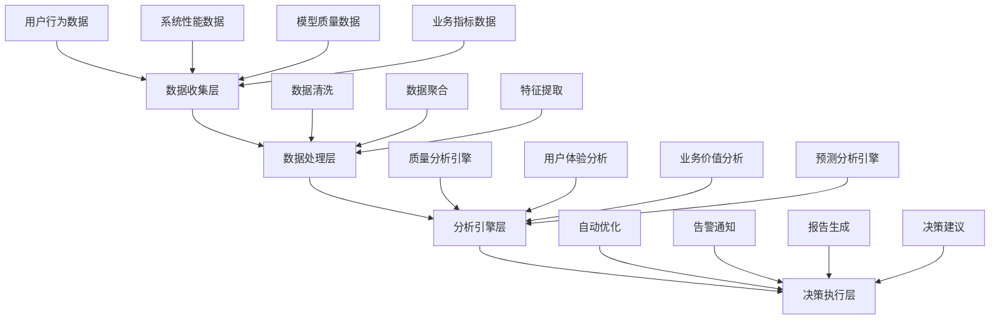

# 4. 3D模型生成效果评估系统

## 4.1 评估系统概述

### 4.1.1 系统目标
3D模型生成作为典型的AI应用场景，与传统应用的核心差异在于输出结果的不确定性和持续优化需求。为此，我们设计了一套科学、全面的评估体系，旨在实现以下目标：
- **量化生成效果**：建立客观、可衡量的质量评估标准
- **指导迭代优化**：通过数据驱动确定改进方向和优先级
- **提升用户体验**：持续优化模型质量和交互效率，提高用户满意度
- **控制业务风险**：及时发现和解决潜在质量问题，确保系统稳定运行

### 4.1.2 评估维度框架
我们构建了一个多维度协同的评估框架，覆盖技术、用户体验、业务价值和系统性能四个核心层面：

```
技术质量维度 ←→ 用户体验维度
     ?              ?
   业务价值维度 ←→ 系统性能维度
```
该框架确保评估既关注技术实现质量，也充分考虑用户实际感受和业务价值贡献，同时兼顾系统性能表现，形成全面均衡的评估体系。
## 4.2 关键评估指标体系

### 4.2.1 技术质量指标

#### 模型几何质量评分（待实现）
**指标定义**：用于评估生成3D模型的几何结构合理性和精度
**实现方式：**
```java
@Component
public class GeometryQualityAnalyzer {
    
    public GeometryQualityScore analyzeModel(Model3D model) {
        return GeometryQualityScore.builder()
            .vertexCount(calculateVertexScore(model.getVertexCount()))
            .faceCount(calculateFaceScore(model.getFaceCount()))
            .topology(analyzeTopology(model))
            .geometryAccuracy(calculateAccuracy(model))
            .build();
    }
    
    private double calculateVertexScore(int vertexCount) {
        // 顶点数量合理性评分 (20%)
        if (vertexCount < 100) return 0.3;
        if (vertexCount > 100000) return 0.5;
        return Math.min(1.0, vertexCount / 10000.0);
    }
}
```

**评分标准**：
- **优秀 (85-100分)**：拓扑结构完整，几何精度高，面数适中，无明显缺陷
- **良好 (70-84分)**：结构基本合理，精度符合要求，局部细节可优化
- **需改进 (<70分)**：存在明显几何缺陷或结构问题，影响使用体验，需修复或优化

#### 纹理质量评估（待实现）
**指标定义**：用于评估模型纹理和材质的视觉质量
```java
@Service
public class TextureQualityService {
    
    public TextureQualityMetrics evaluateTexture(Model3D model) {
        BufferedImage texture = model.getTextureImage();
        
        return TextureQualityMetrics.builder()
            .resolution(calculateResolutionScore(texture))
            .colorAccuracy(analyzeColorAccuracy(texture, model.getDescription()))
            .uvMapping(validateUVMapping(model))
            .detailRichness(calculateDetailScore(texture))
            .overallScore(calculateOverallTextureScore())
            .build();
    }
    
    private double calculateResolutionScore(BufferedImage texture) {
        int resolution = texture.getWidth() * texture.getHeight();
        // 512x512 = 1.0分, 1024x1024 = 0.9分 (考虑性能)
        return Math.min(1.0, 262144.0 / resolution);
    }
}
```

####  模型完整性检查
**自动化检测指标：**
```java
@Component
public class ModelIntegrityChecker {
    
    public IntegrityReport checkModel(String modelPath) {
        IntegrityReport report = new IntegrityReport();
        
        // 1. 文件格式验证
        report.setFormatValid(validateFileFormat(modelPath));
        
        // 2. 文件大小检查 (1MB-50MB合理范围)
        long fileSize = getFileSize(modelPath);
        report.setFileSizeScore(calculateFileSizeScore(fileSize));
        
        // 3. 模型结构完整性
        Model3D model = loadModel(modelPath);
        report.setStructureComplete(validateStructure(model));
        
        // 4. 材质信息完整性
        report.setMaterialComplete(validateMaterials(model));
        
        return report;
    }
}
```

####  生成成功率统计
**核心KPI指标：**
```java
@Service
public class GenerationSuccessRateService {
    
    @Scheduled(fixedRate = 300000) // 每5分钟统计一次
    public void calculateSuccessRate() {
        LocalDateTime now = LocalDateTime.now();
        LocalDateTime oneHourAgo = now.minusHours(1);
        
        long totalRequests = taskRepository.countByCreatedTimeBetween(oneHourAgo, now);
        long successfulRequests = taskRepository.countByStatusAndCreatedTimeBetween(
            TaskStatus.COMPLETED, oneHourAgo, now);
        
        double successRate = (double) successfulRequests / totalRequests * 100;
        
        // 记录指标
        meterRegistry.gauge("generation.success.rate", successRate);
        
        // 告警检查
        if (successRate < 90.0) {
            alertService.sendAlert("生成成功率低于90%: " + successRate + "%");
        }
    }
}
```

### 4.2.2 用户体验指标

#### ? 响应时间分析
**分层响应时间目标：**
```java
@Component
public class ResponseTimeAnalyzer {
    
    public ResponseTimeMetrics analyzeResponseTime(String taskId) {
        ModelTask task = taskRepository.findById(taskId);
        
        return ResponseTimeMetrics.builder()
            .cacheHitTime(calculateCacheHitTime(task))
            .similarityMatchTime(calculateSimilarityTime(task))
            .newGenerationTime(calculateGenerationTime(task))
            .totalResponseTime(calculateTotalTime(task))
            .performanceGrade(calculatePerformanceGrade(task))
            .build();
    }
    
    private PerformanceGrade calculatePerformanceGrade(ModelTask task) {
        long totalTime = task.getCompletedAt().getTime() - task.getCreatedAt().getTime();
        
        if (task.getCacheHit() && totalTime <= 3000) return PerformanceGrade.EXCELLENT;
        if (task.getSimilarityMatch() && totalTime <= 8000) return PerformanceGrade.GOOD;
        if (!task.getCacheHit() && totalTime <= 30000) return PerformanceGrade.ACCEPTABLE;
        return PerformanceGrade.POOR;
    }
}
```

**响应时间目标标准**：
- **完全匹配缓存命中**：≤3秒 (优秀体验标准)
- **相似度匹配命中**：≤8秒 (良好体验标准)
- **新生成请求**：≤30秒 (可接受体验标准)
- **超时请求**：>30秒 (需重点优化场景)

####  用户满意度评估
**多维度满意度收集：**
```java
@Entity
public class UserFeedback {
    private String taskId;
    private Integer modelQualityRating; // 1-5分
    private Integer speedSatisfaction;  // 1-5分
    private Integer usabilityRating;    // 1-5分
    private Integer overallRating;      // 1-5分
    private String textualFeedback;
    private LocalDateTime createdAt;
}

@Service
public class SatisfactionAnalysisService {
    
    public SatisfactionReport generateReport(LocalDate date) {
        List<UserFeedback> feedbacks = feedbackRepository.findByDate(date);
        
        return SatisfactionReport.builder()
            .averageModelQuality(calculateAverage(feedbacks, UserFeedback::getModelQualityRating))
            .averageSpeed(calculateAverage(feedbacks, UserFeedback::getSpeedSatisfaction))
            .averageUsability(calculateAverage(feedbacks, UserFeedback::getUsabilityRating))
            .overallSatisfaction(calculateAverage(feedbacks, UserFeedback::getOverallRating))
            .npsScore(calculateNPS(feedbacks))
            .build();
    }
}
```

####  用户行为分析
**关键行为指标：**
```java
@Service
public class UserBehaviorAnalyzer {
    
    public BehaviorMetrics analyzeBehavior(String userId, LocalDate date) {
        return BehaviorMetrics.builder()
            .sessionDuration(calculateSessionDuration(userId, date))
            .generationAttempts(countGenerationAttempts(userId, date))
            .downloadRate(calculateDownloadRate(userId, date))
            .retryRate(calculateRetryRate(userId, date))
            .featureUsage(analyzeFeatureUsage(userId, date))
            .build();
    }
    
    private double calculateDownloadRate(String userId, LocalDate date) {
        long completedTasks = taskRepository.countCompletedByUserAndDate(userId, date);
        long downloadedTasks = downloadRepository.countByUserAndDate(userId, date);
        return completedTasks > 0 ? (double) downloadedTasks / completedTasks : 0.0;
    }
}
```

### 4.2.3 业务价值指标

####  成本效益分析
**ROI计算模型：**
```java
@Service
public class ROICalculationService {
    
    public ROIMetrics calculateROI(LocalDate startDate, LocalDate endDate) {
        // 成本计算
        double apiCosts = calculateAPICosts(startDate, endDate);
        double infrastructureCosts = calculateInfrastructureCosts(startDate, endDate);
        double developmentCosts = calculateDevelopmentCosts(startDate, endDate);
        double totalCosts = apiCosts + infrastructureCosts + developmentCosts;
        
        // 收益计算
        double directRevenue = calculateDirectRevenue(startDate, endDate);
        double costSavings = calculateCostSavings(startDate, endDate);
        double productivityGains = calculateProductivityGains(startDate, endDate);
        double totalBenefits = directRevenue + costSavings + productivityGains;
        
        // ROI计算
        double roi = (totalBenefits - totalCosts) / totalCosts * 100;
        
        return ROIMetrics.builder()
            .totalCosts(totalCosts)
            .totalBenefits(totalBenefits)
            .roi(roi)
            .paybackPeriod(calculatePaybackPeriod(totalCosts, totalBenefits))
            .build();
    }
}
```

####  用户增长指标
**增长漏斗分析：**
```java
@Service
public class GrowthMetricsService {
    
    public GrowthFunnelMetrics calculateFunnel(LocalDate date) {
        long visitors = analyticsRepository.countVisitors(date);
        long signups = userRepository.countSignupsByDate(date);
        long firstTimeUsers = taskRepository.countFirstTimeUsers(date);
        long activeUsers = userRepository.countActiveUsers(date);
        long retainedUsers = userRepository.countRetainedUsers(date);
        
        return GrowthFunnelMetrics.builder()
            .visitorToSignup(calculateConversionRate(visitors, signups))
            .signupToFirstUse(calculateConversionRate(signups, firstTimeUsers))
            .firstUseToActive(calculateConversionRate(firstTimeUsers, activeUsers))
            .activeToRetained(calculateConversionRate(activeUsers, retainedUsers))
            .overallConversion(calculateConversionRate(visitors, retainedUsers))
            .build();
    }
}
```

## 4.3 评估系统架构设计

### 4.3.1 系统架构图


### 4.3.2 数据收集层实现
```java
@Component
public class DataCollector {
    
    @EventListener
    public void collectModelGenerationData(ModelGenerationEvent event) {
        ModelGenerationMetrics metrics = ModelGenerationMetrics.builder()
            .taskId(event.getTaskId())
            .inputType(event.getInputType())
            .inputContent(event.getInputContent())
            .generationTime(event.getGenerationTime())
            .modelQuality(event.getQualityScore())
            .cacheHit(event.isCacheHit())
            .timestamp(LocalDateTime.now())
            .build();
            
        metricsRepository.save(metrics);
        
        // 实时流处理
        kafkaTemplate.send("model-generation-metrics", metrics);
    }
    
    @EventListener
    public void collectUserBehaviorData(UserBehaviorEvent event) {
        UserBehaviorMetrics behavior = UserBehaviorMetrics.builder()
            .userId(event.getUserId())
            .sessionId(event.getSessionId())
            .action(event.getAction())
            .timestamp(event.getTimestamp())
            .metadata(event.getMetadata())
            .build();
            
        behaviorRepository.save(behavior);
    }
}
```

### 4.3.3 实时分析引擎
```java
@Service
public class RealTimeAnalysisEngine {
    
    @KafkaListener(topics = "model-generation-metrics")
    public void processGenerationMetrics(ModelGenerationMetrics metrics) {
        // 1. 实时质量检查
        if (metrics.getModelQuality() < 70) {
            alertService.sendQualityAlert(metrics);
        }
        
        // 2. 性能监控
        if (metrics.getGenerationTime() > 45000) {
            performanceMonitor.recordSlowGeneration(metrics);
        }
        
        // 3. 缓存效果分析
        cacheAnalyzer.updateCacheMetrics(metrics);
        
        // 4. 用户体验评分更新
        userExperienceScorer.updateScore(metrics);
    }
    
    @Scheduled(fixedRate = 60000) // 每分钟执行
    public void generateRealTimeReport() {
        RealTimeReport report = RealTimeReport.builder()
            .timestamp(LocalDateTime.now())
            .currentQPS(getCurrentQPS())
            .averageResponseTime(getAverageResponseTime())
            .successRate(getSuccessRate())
            .cacheHitRate(getCacheHitRate())
            .userSatisfactionScore(getUserSatisfactionScore())
            .build();
            
        reportService.publishRealTimeReport(report);
    }
}
```

## 4.4 自动化改善系统

### 4.4.1 智能优化引擎
```java
@Service
public class IntelligentOptimizationEngine {
    
    @Scheduled(cron = "0 0 2 * * ?") // 每天凌晨2点执行
    public void performDailyOptimization() {
        OptimizationReport report = analyzeYesterdayData();
        
        // 1. 缓存策略优化
        if (report.getCacheHitRate() < 0.6) {
            optimizeCacheStrategy(report);
        }
        
        // 2. 相似度阈值调整
        if (report.getSimilarityMatchAccuracy() < 0.8) {
            adjustSimilarityThreshold(report);
        }
        
        // 3. 资源分配优化
        if (report.getAverageResponseTime() > 25000) {
            optimizeResourceAllocation(report);
        }
        
        // 4. 质量控制参数调整
        if (report.getAverageQualityScore() < 75) {
            adjustQualityParameters(report);
        }
    }
    
    private void optimizeCacheStrategy(OptimizationReport report) {
        // 分析热点数据
        List<String> hotInputs = report.getHotInputs();
        
        // 预热缓存
        cacheWarmupService.warmupCache(hotInputs);
        
        // 调整缓存容量
        if (report.getCacheEvictionRate() > 0.1) {
            cacheConfigService.increaseCacheSize();
        }
    }
}
```

### 4.4.2 A/B测试框架
```java
@Service
public class ABTestingService {
    
    public void createExperiment(ABTestConfig config) {
        ABExperiment experiment = ABExperiment.builder()
            .name(config.getName())
            .description(config.getDescription())
            .controlGroup(config.getControlGroup())
            .treatmentGroup(config.getTreatmentGroup())
            .trafficSplit(config.getTrafficSplit())
            .startDate(LocalDateTime.now())
            .endDate(LocalDateTime.now().plusDays(config.getDurationDays()))
            .status(ExperimentStatus.ACTIVE)
            .build();
            
        experimentRepository.save(experiment);
    }
    
    public String assignUserToGroup(String userId, String experimentName) {
        ABExperiment experiment = experimentRepository.findByName(experimentName);
        
        // 基于用户ID的一致性哈希分组
        int hash = userId.hashCode();
        double ratio = (hash % 100) / 100.0;
        
        if (ratio < experiment.getTrafficSplit()) {
            return "treatment";
        } else {
            return "control";
        }
    }
    
    public ABTestResult analyzeExperiment(String experimentName) {
        ABExperiment experiment = experimentRepository.findByName(experimentName);
        
        // 收集对照组和实验组数据
        ExperimentMetrics controlMetrics = collectMetrics(experiment, "control");
        ExperimentMetrics treatmentMetrics = collectMetrics(experiment, "treatment");
        
        // 统计显著性检验
        double pValue = statisticalTest.tTest(controlMetrics, treatmentMetrics);
        
        return ABTestResult.builder()
            .experimentName(experimentName)
            .controlMetrics(controlMetrics)
            .treatmentMetrics(treatmentMetrics)
            .pValue(pValue)
            .isSignificant(pValue < 0.05)
            .recommendation(generateRecommendation(controlMetrics, treatmentMetrics, pValue))
            .build();
    }
}
```

## 4.5 监控和告警系统

### 4.5.1 多层级监控架构
```java
@Configuration
public class MonitoringConfig {
    
    @Bean
    public MeterRegistry meterRegistry() {
        return new PrometheusMeterRegistry(PrometheusConfig.DEFAULT);
    }
    
    @Bean
    public TimedAspect timedAspect(MeterRegistry registry) {
        return new TimedAspect(registry);
    }
}

@Component
public class QualityMetricsCollector {
    
    private final MeterRegistry meterRegistry;
    private final Counter qualityAlertCounter;
    private final Timer responseTimeTimer;
    private final Gauge cacheHitRateGauge;
    
    public QualityMetricsCollector(MeterRegistry meterRegistry) {
        this.meterRegistry = meterRegistry;
        this.qualityAlertCounter = Counter.builder("quality.alerts")
            .description("Quality alert count")
            .register(meterRegistry);
        this.responseTimeTimer = Timer.builder("response.time")
            .description("Response time")
            .register(meterRegistry);
    }
    
    @EventListener
    public void recordQualityMetrics(QualityEvaluationEvent event) {
        // 记录质量分数分布
        meterRegistry.gauge("model.quality.score", event.getQualityScore());
        
        // 记录响应时间
        responseTimeTimer.record(event.getResponseTime(), TimeUnit.MILLISECONDS);
        
        // 质量告警计数
        if (event.getQualityScore() < 70) {
            qualityAlertCounter.increment();
        }
    }
}
```

### 4.5.2 智能告警系统
```java
@Service
public class IntelligentAlertService {
    
    private final Map<String, AlertRule> alertRules = new HashMap<>();
    
    @PostConstruct
    public void initializeAlertRules() {
        // P0级告警：系统不可用
        alertRules.put("system_down", AlertRule.builder()
            .name("系统不可用")
            .condition("success_rate < 0.5")
            .severity(AlertSeverity.P0)
            .cooldown(Duration.ofMinutes(5))
            .build());
            
        // P1级告警：性能严重下降
        alertRules.put("performance_degradation", AlertRule.builder()
            .name("性能严重下降")
            .condition("avg_response_time > 60000")
            .severity(AlertSeverity.P1)
            .cooldown(Duration.ofMinutes(10))
            .build());
            
        // P2级告警：质量下降
        alertRules.put("quality_degradation", AlertRule.builder()
            .name("模型质量下降")
            .condition("avg_quality_score < 70")
            .severity(AlertSeverity.P2)
            .cooldown(Duration.ofMinutes(30))
            .build());
    }
    
    @Scheduled(fixedRate = 30000) // 每30秒检查一次
    public void checkAlertConditions() {
        SystemMetrics currentMetrics = metricsCollector.getCurrentMetrics();
        
        for (AlertRule rule : alertRules.values()) {
            if (evaluateCondition(rule.getCondition(), currentMetrics)) {
                if (shouldTriggerAlert(rule)) {
                    triggerAlert(rule, currentMetrics);
                }
            }
        }
    }
    
    private void triggerAlert(AlertRule rule, SystemMetrics metrics) {
        Alert alert = Alert.builder()
            .ruleName(rule.getName())
            .severity(rule.getSeverity())
            .message(generateAlertMessage(rule, metrics))
            .timestamp(LocalDateTime.now())
            .metrics(metrics)
            .build();
            
        // 发送告警
        alertNotificationService.sendAlert(alert);
        
        // 记录告警历史
        alertHistoryRepository.save(alert);
        
        // 更新冷却时间
        updateCooldown(rule);
    }
}
```

## 4.6 评估报告和可视化

### 4.6.1 Grafana仪表板配置
```json
{
  "dashboard": {
    "title": "3D模型生成质量监控",
    "panels": [
      {
        "title": "模型质量评分趋势",
        "type": "graph",
        "targets": [
          {
            "expr": "avg_over_time(model_quality_score[5m])",
            "legendFormat": "平均质量评分"
          }
        ],
        "yAxes": [
          {
            "min": 0,
            "max": 100,
            "unit": "short"
          }
        ]
      },
      {
        "title": "响应时间分布",
        "type": "heatmap",
        "targets": [
          {
            "expr": "histogram_quantile(0.95, response_time_bucket)",
            "legendFormat": "P95响应时间"
          }
        ]
      },
      {
        "title": "用户满意度评分",
        "type": "stat",
        "targets": [
          {
            "expr": "avg(user_satisfaction_score)",
            "legendFormat": "平均满意度"
          }
        ],
        "fieldConfig": {
          "defaults": {
            "min": 1,
            "max": 5,
            "thresholds": {
              "steps": [
                {"color": "red", "value": 0},
                {"color": "yellow", "value": 3},
                {"color": "green", "value": 4}
              ]
            }
          }
        }
      }
    ]
  }
}
```

### 4.6.2 自动化报告生成
```java
@Service
public class ReportGenerationService {
    
    @Scheduled(cron = "0 0 9 * * MON") // 每周一上午9点
    public void generateWeeklyReport() {
        LocalDate endDate = LocalDate.now().minusDays(1);
        LocalDate startDate = endDate.minusDays(7);
        
        WeeklyReport report = WeeklyReport.builder()
            .reportPeriod(startDate + " to " + endDate)
            .qualityMetrics(calculateWeeklyQualityMetrics(startDate, endDate))
            .performanceMetrics(calculateWeeklyPerformanceMetrics(startDate, endDate))
            .userExperienceMetrics(calculateWeeklyUXMetrics(startDate, endDate))
            .businessMetrics(calculateWeeklyBusinessMetrics(startDate, endDate))
            .recommendations(generateRecommendations(startDate, endDate))
            .build();
            
        // 生成PDF报告
        byte[] pdfReport = reportPDFGenerator.generatePDF(report);
        
        // 发送邮件
        emailService.sendWeeklyReport(pdfReport, getStakeholderEmails());
        
        // 存储报告
        reportRepository.save(report);
    }
    
    private List<String> generateRecommendations(LocalDate startDate, LocalDate endDate) {
        List<String> recommendations = new ArrayList<>();
        
        // 基于数据分析生成建议
        QualityTrend qualityTrend = analyzeQualityTrend(startDate, endDate);
        if (qualityTrend.isDecreasing()) {
            recommendations.add("模型质量呈下降趋势，建议检查API参数配置");
        }
        
        PerformanceTrend perfTrend = analyzePerformanceTrend(startDate, endDate);
        if (perfTrend.getAverageResponseTime() > 25000) {
            recommendations.add("响应时间偏高，建议优化缓存策略或增加服务器资源");
        }
        
        return recommendations;
    }
}
```

## 4.7 持续改进机制

### 4.7.1 反馈闭环系统
```java
@Service
public class FeedbackLoopService {
    
    public void processFeedback(UserFeedback feedback) {
        // 1. 立即处理负面反馈
        if (feedback.getOverallRating() <= 2) {
            handleNegativeFeedback(feedback);
        }
        
        // 2. 分析反馈模式
        FeedbackPattern pattern = analyzeFeedbackPattern(feedback);
        
        // 3. 触发改进措施
        if (pattern.requiresImprovement()) {
            triggerImprovementAction(pattern);
        }
        
        // 4. 更新模型参数
        updateModelParameters(feedback);
    }
    
    private void handleNegativeFeedback(UserFeedback feedback) {
        // 创建改进任务
        ImprovementTask task = ImprovementTask.builder()
            .feedbackId(feedback.getId())
            .priority(TaskPriority.HIGH)
            .description("处理用户负面反馈: " + feedback.getTextualFeedback())
            .assignee(getQualityTeamLead())
            .dueDate(LocalDateTime.now().plusDays(1))
            .build();
            
        taskManagementService.createTask(task);
        
        // 发送通知
        notificationService.notifyQualityTeam(task);
    }
}
```

### 4.7.2 机器学习驱动的优化
```java
@Service
public class MLDrivenOptimizationService {
    
    private final PredictionModel qualityPredictionModel;
    private final OptimizationModel parameterOptimizationModel;
    
    @Scheduled(cron = "0 0 3 * * ?") // 每天凌晨3点
    public void performMLOptimization() {
        // 1. 收集训练数据
        List<TrainingData> trainingData = collectTrainingData();
        
        // 2. 重新训练质量预测模型
        qualityPredictionModel.retrain(trainingData);
        
        // 3. 预测质量趋势
        QualityPrediction prediction = qualityPredictionModel.predict(
            LocalDate.now().plusDays(7)
        );
        
        // 4. 如果预测质量下降，触发预防性优化
        if (prediction.getPredictedQuality() < 75) {
            performPreventiveOptimization(prediction);
        }
        
        // 5. 参数优化
        OptimalParameters optimalParams = parameterOptimizationModel.optimize(
            getCurrentSystemState()
        );
        
        // 6. 应用优化参数
        applyOptimizedParameters(optimalParams);
    }
    
    private void performPreventiveOptimization(QualityPrediction prediction) {
        log.info("预测到质量下降，执行预防性优化: {}", prediction);
        
        // 增加缓存预热
        cacheWarmupService.increaseWarmupFrequency();
        
        // 调整相似度阈值
        similarityService.adjustThreshold(0.88); // 提高阈值
        
        // 增加质量检查频率
        qualityCheckService.increaseCheckFrequency();
    }
}
```

通过建立科学完善的评估体系，我们实现了以下核心价值：
1. **质量保障**：确保生成的3D模型符合业务标准和用户期望
2. **效率提升**：通过数据驱动优化，持续提升系统性能和响应速度
3. **决策支持**：为产品迭代和技术选型提供客观数据依据
4. **风险控制**：及时发现潜在问题，降低业务风险

### 未来发展方向
评估系统将持续演进，未来发展方向包括：
1. **智能化评估**：引入机器学习模型自动识别和评估模型质量
2. **多模态评估**：扩展评估维度，支持更多输入输出模态
3. **个性化评估**：根据不同用户群体和应用场景提供定制化评估标准
4. **实时优化**：从批量离线优化向实时在线优化演进

通过这一全面的评估系统，我们不仅能够确保3D模型生成的质量和稳定性，还能够持续优化用户体验和业务价值，为产品的长期成功提供坚实的数据基础和决策支持。